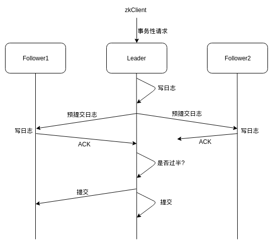

## 基础知识

#### 定义

是一个数据库

是一个拥有文件系统特点的数据库

是一个解决了数据一致性（最终一致性）问题的分布式数据库

是一个具有发布和订阅功能的分布式数据库

#### 能做的事情

命名服务

配置中心

分布式锁

发布/订阅

分布式协调通知

znode：

创建znode：`create [-s][-e] path data acl`

-s表示顺序节点，-e表示临时节点，path表示节点路径，data表示节点数据，acl表示访问控制

临时节点、顺序节点、持久节点

临时节点不允许有子节点，sessionTimeout之后会被zk自动删掉

顺序节点：

curator提供对三种cache的Watcher：TreeCache、NodeCache、PathChildrenCache

利用zk选主：zkclient、curator分别归纳总结

zk如何实现分布式锁？

排他锁、共享锁

zk集群节点数量为什么是奇数个？

1. 如果是偶数个，有可能因发生脑裂而无法完成leader选举
2. 在容错能力相同的情况下，奇数台机器更节省资源

为了实现数据一致性，ZAB协议实现了：

- 领导选举

  投票 -> 心里想投给自己 -> 交流比较，找到更厉害的人 -> 投给厉害的人 -> 统计票数

  谁是更“厉害”的zk节点？

  

  zk把请求分为2类：

  事务性请求：增、删、改，涉及到数据变更的请求；创建会话

  非事务性请求：读请求

  

  zk如何处理请求？

  内存中DataTree存放了所有数据

  处理非事务性请求：直接从内存DataTree读取，非常快

  处理事务性请求：先把请求的日志持久化到磁盘，再更新内存中的DataTree；每处理若干个请求(2000个)，就把DataTree写到磁盘，称为一个快照，同时删除日志，使得剩余的日志对于此快照来说都是未被处理过的操作。

  

  每条日志都有一个自增的编号，称为zxid。由于zk本质上是数据库，所以判断谁“更厉害”的依据就是看谁的数据是更新的，也就是比较zk节点当前的最大zkid，具有更大的最大zkid的节点会得到选票；如果最大zxid相等，就选择服务器编号myid（写死在配置文件）更大的那个zk节点

  

  领导者选举的时机：

  集群启动

  leader挂掉

  follower挂掉后leader发现已经没有过半的follower跟随自己了，不能对外提供服务了（在进行领导者选举的过程中zk主动关闭了对外的服务，所以当没有过半follower的时候，zk为了不对外提供服务，触发了领导者选举）

  除此之外不会发生领导者选举。

  某zk集群有3个节点，分别是A、B、C，节点A是leader。A在接收了一次事务性请求w后，把zxid自增1后马上就挂掉了，这时候B和C的zxid没变；假设此时C经过选举成为了leader，接着A重新启动试图加入集群，虽然A的zxid比B和C的都要大，但此时并不会触发领导者选举，因为A的zxid是无效的（客户端接收到w的响应是失败），接下来A成为follower并从其他节点同步日志和快照。

- 过半机制

- 2PC

集群中的3种角色

- Leader领导者
- Follower跟随者
- Observer观察者

Follower和Observer合起来称为Learner

Leader：是zookeeper集群工作机制的核心

- 事务请求的唯一调度者和处理者，保证集群事务处理的顺序性
- 集群内部各服务器的调度者

Follower：是zookeeper集群状态的跟随者

- 处理客户端非事务请求，转发事务请求给Leader
- 参与事务请求Proposal的投票
- 参与领导者选举投票

Observer：和Follower唯一的区别在于，Observer不参与任何投票，包括事务请求Proposal的投票和领导者选举的投票。

- 处理客户端非事务请求，转发事务请求给Leader

为什么引入Observer？

zookeeper 3.3.0版本之前是只有Leader和Follower两种服务器角色的，当对集群进行扩容时，增加的机器都是Follower，这回带来一个问题：每次Leader处理事务性请求时都需要得到过半的Follower的投票达成一致，随着更多Follower的加入，投票的成本就会不断增加，影响处理事务性请求的性能。所以引入不参与任何投票的Observer来解决上面的问题，同时也提升了集群对非事务性请求的处理能力。

Observer还有其它用途。因为它不参与投票，不是zk集群的重要组成部分，挂掉对集群影响不大，相比Follower来说也更能通过不太可靠的网络进行连接，所以Observer可用于与另一个数据中心的zk服务器通信，只负责从Leader同步数据然后处理读请求即可。

下图描述了在一个由3个节点组成的zk集群中，当zkClient向Leader发送了一个事务性请求（写请求）时，zk是如何对该事务进行两阶段提交的。

Leader首先写本地日志，然后向2个Follower发送预提交日志请求（这里没有Observer，即使有也不会向Observer发送），预提交日志请求也被成为Proposal投票，含义是Leader提出一个对内存进行变更的“提议”。Follower收到请求尝试写本地日志，如果成功则发送ACK回包给Leader表示“同意”，这时Follower有可能写失败不发ACK，有可能因为网络原因ACK丢包，也有可能延迟太大、Leader超过最大等待时间仍未收到ACK。Leader判断收到的ACK数量加1（加上自己）是否超过节点数的一半：如果未过一半，则返回客户端写失败；过一半则异步向成功ACK的Follower发送提交命令，同时做本地提交（根据日志更新内存DataTree），返回客户端写成功。注意，这里是异步发送提交命令，实际上是塞进本地队列，由专门的线程取出并发送，这里如果失败，会造成短时间内节点间数据不一致的情况，因为Leader本地的数据已经更新了，而Follower的本地数据未更新。为什么说是短时间内不一致？因为zk有数据同步的机制，会保证节点间数据的最终一致性。

这就说明了zk没有保证数据的强一致性，而是保证了最终一致性。

- 数据同步

## 典型应用场景