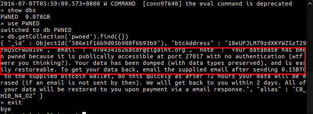
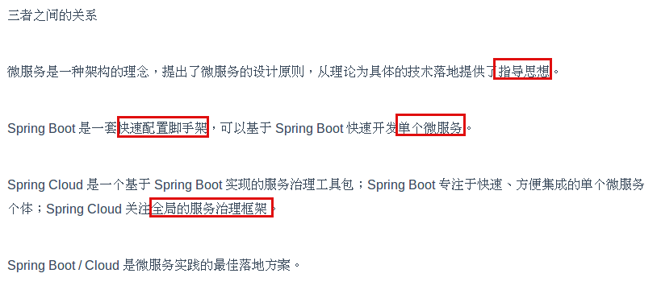
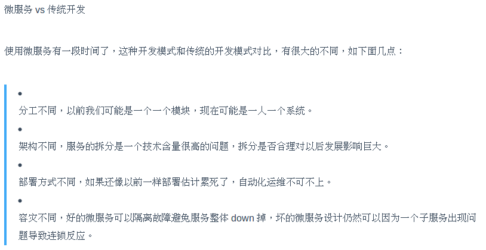
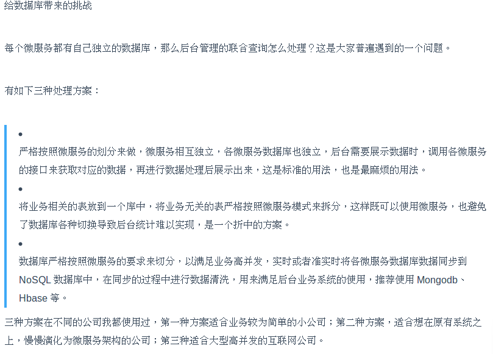

这里记录了我近期读过的科技类文章和资讯，以及我个人的看法和文摘。不定时更新...
(按阅读时间由近及远顺序)

---

### 4# 谈谈最近MongoDB数据库勒索事件

> 标题:《谈谈最近MongoDB数据库勒索事件》
> 原文:https://www.imooc.com/article/34939
> 日期:2019-01-24

最近的MongoDB数据库勒索事件在国外安全圈可谓是掀起了不小的波澜，甚至上了BBC NEWS，但我基本没在国内媒体听说过这件事。。。

事情是这样的。

国外某安全大大发推说一些IP暴露在公网下的MongoDB被删库了，留下一张叫warning的表，里面写着：

```
SEND 0.2 BTC TO THIS ADDRESS AND CONTACT THIS EMAIL WITH YOUR IP OF YOUR SERVER TO RECOVER YOUR DATABASE! 
```

意思是向我这个地址发0.2个比特币（相当于人民币4800多），然后给我发个邮件，附上你的IP，我就给你恢复数据！

又是勒索比特币，你敢不敢勒索点别的？（额，好像勒索别的你就暴露了。。。）

如果这事儿被我遇上了，我肯定不会汇款的，谁知道汇了款你会不会给我恢复数据呢，也许你就是直接删了压根儿没做备份呢！

话说回来，为啥有这么多的MongoDB被入侵呢？他们怎么不选择Mysql下手呢？原来MongoDB默认是不会开启访问控制的，也就是说只要你拿到了宿主机IP，只要你能ping通，就能远程访问别人的数据库了。

出于好奇，我试了以下。

首先我在[shodan](https://www.shodan.io/)上搜索MongoDB country:"CN"，惊奇地发现返回的结果有一万多条，随便找了一个IP试试

```
./mongo --host xxx.xxx.xxx.xxx
```

果然登入成功了，里面的数据可以随意观看。。。

很多人把锅推给了MongoDB，说你为什么默认设置不开访问控制呢？要我说，这事儿只能怪自己，谁让你自己心这么大呢！

这不，连hacker都看不下去了："wtf were you thinking?"



---

### 3# 放弃Dubbo，选择最流行的Spring Cloud微服务架构实践与经验总结

> 标题:《放弃Dubbo，选择最流行的Spring Cloud微服务架构实践与经验总结》
  原文:https://sdk.cn/news/7622
  日期:2017-11-15

“微服务”的概念早在2014年就被提出了，但是很惭愧地讲，我是今年８月份参加深圳某物流科技公司的面试才第一次听说，面试官问我听没听说过微服务，我说没有，但我听过dubbo，实习期间也用到过dubbo，于是跟面试官吹了一会儿dubbo，他就没再问微服务的事儿。。。

这篇文章主要描述了公司从传统的dubbo向微服务架构转变的经历，其中以下几点我觉得很有用，果断截图记录之。







---

### 2# 微信“15。。。。。”背后的故事
> 标题:《微信“15。。。。。”背后的故事》
  原文:https://sdk.cn/news/7585
  日期:2017-11-14

这是微信的一个bug，说是在安卓版微信上输入"15。。。。。。。。。。。。。。。"会导致微信ANR(Application Not Responding)。这篇文章分析了这个bug产生的原因：有段代码一直在while中死循环。

其实这个bug是怎么解决的不重要，重要的是背后的**思考**和一些值得学习的**产品思维**。

首先，为什么会产生这个bug？原生的组件TextView是不会产生这个bug的，问题出在微信自己的组件CellTextView。微信为什么放着原生TextView不用，非要自己造一个轮子呢？因为有用户吐槽TextView丑啊！

既然有人说丑，微信决定试着改改吧~怎么改是个问题－先看看其他app是怎么做的：支付宝，知乎，掘金。。。好像都很丑啊！那么，就这样放着不管了？不可以，我们是微信，我们要做最好的产品，于是看看微软是怎么做的，毕竟word在文字排版方面的地位还是很高的。果然，在word里找到了灵感，确定了动态调整字间距的方式，也就是“最多允许有一个英文字符宽度的调整范围，将调整的宽度平均分配到当前行每个字符中去”。

确定了方案就开始实施，这时有两种选择，一种是改造TextView，另一种是自定义组件，微信选择后者有其技术上的考量。

其后，微信又做了针对全角字符的规则优化，针对小语种的组件区分等优化。

这还没完，微信又做了组件适配率的灰度测试，弄清楚到底使用这个自定义组件的用户占总数的多少；同时，又做了自定义与TextView在性能上的对比，确保新组件不会严重影响帧率造成卡顿。等等。

最终，完成了这个需求。

在整个过程中，有很多值得思考和学习的地方，这个例子也印证了为什么微信可以被称作中国最成功的互联网产品。

---

### 1# 这里有个互联网坟场，收录1000多个你可能曾天天用的产品
> 标题:《这里有个互联网坟场，收录1000多个你可能曾天天用的产品》
  原文:https://sdk.cn/news/7378
  日期:2017-11-13

互联网是战场，在战场上就要拼个你死我活，有的产品杀出重围，活得光鲜亮丽，有的就没有那么幸运了，要么火了一段时间被竞品PK下去，要么就是做的太烂无人问津。

正所谓幸福总是相似的，但不幸总是各有各的不幸，这个互联网坟场([Product Graveyard](http://productgraveyard.com/))就是记录各种各样的不幸的。

这里收录了很多已经死掉的互联网产品，很多我们都没有听说过，而且大多数都是国外的app，所以急需一个国内的版本啊(要不考虑做一个？？！)

---

  
